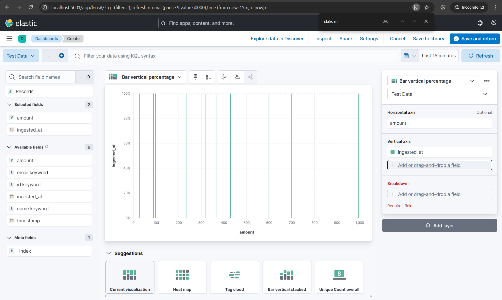
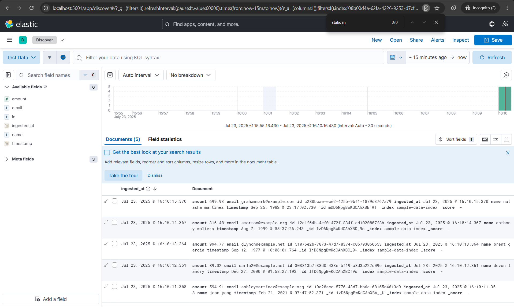
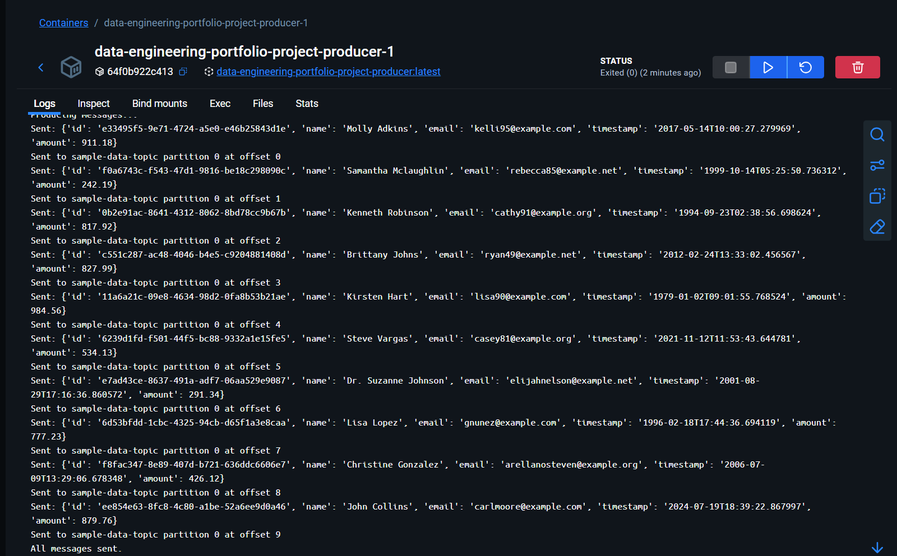
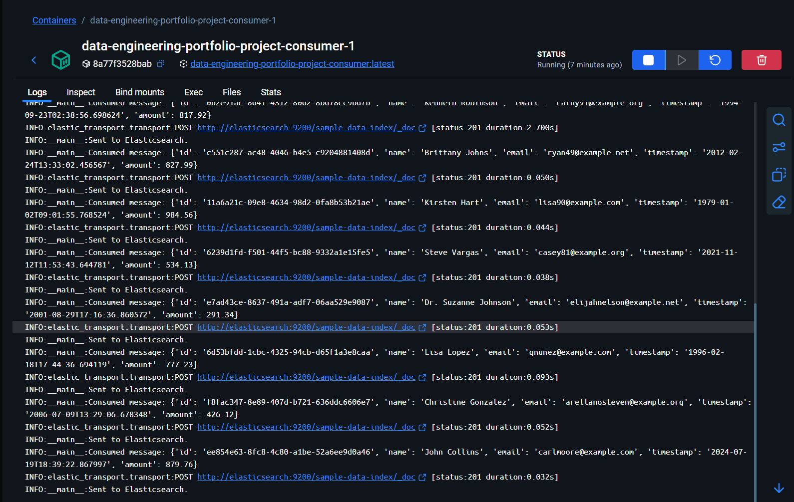
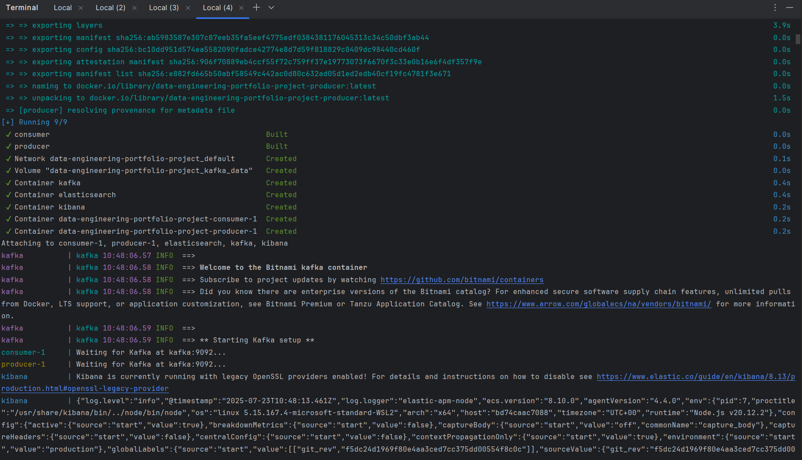
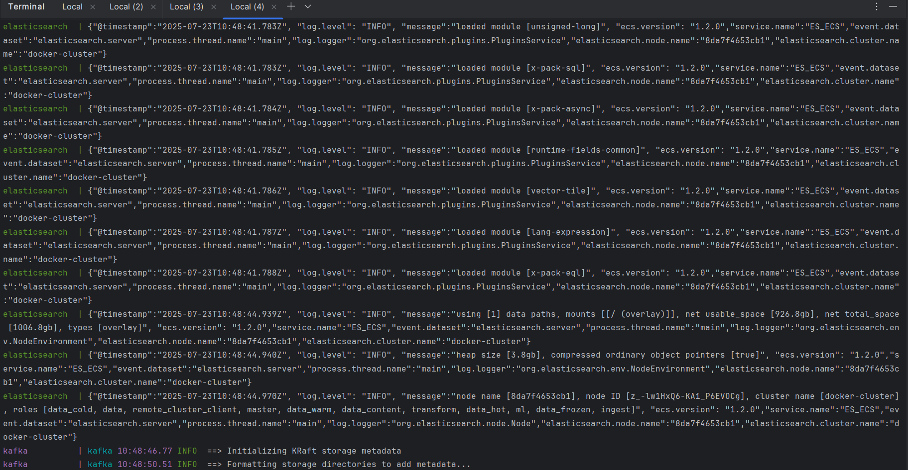

# Real-Time Data Pipeline for Large-Scale Applications

This repository contains a scalable, production-grade real-time data pipeline built with **Python**, **Docker**, **Apache Kafka**, **Elasticsearch**, and **Kibana**. The system is designed to ingest, process, and visualize large volumes of data in real-time.

---

## Overview

The architecture implements a real-time backend for data-intensive applications. It supports:

- High-throughput data ingestion
- Real-time processing and transformation
- Aggregation and indexing
- Live dashboards and analytics
- Full containerization for easy deployment

---

## Architecture

The pipeline is structured into distinct layers for scalability and maintainability:

### 1. Data Source Layer
- Accepts data from external sources such as:
  - CSV files
  - JSON feeds
  - REST APIs

### 2. Ingestion Layer
- **Kafka Producers** collect data and publish it to Kafka topics.

### 3. Processing Layer
- **Kafka Consumers**:
  - Consume data from Kafka
  - Transform and validate records
  - Normalize fields
  - Apply aggregation logic

### 4. Storage Layer
- Aggregated data is stored in **Elasticsearch** for efficient indexing and querying.

### 5. Visualization Layer
- **Kibana** is used to build real-time dashboards and reports based on the data stored in Elasticsearch.

---

## Dockerized Architecture & Orchestration

Each component of the architecture is fully **Dockerized**, enabling consistent, isolated, and reproducible environments. The entire stack is orchestrated using **Docker Compose**, which simplifies multi-container management.

### Benefits:
- Easy to set up and tear down
- Portability across environments
- Consistent development and production workflows
- Simplified orchestration and scaling

## Installation Steps

Run the whole stack using a single command:

```bash
docker-compose up --build
```

## Execution Results


&nbsp;

&nbsp;

&nbsp;

&nbsp;

&nbsp;



